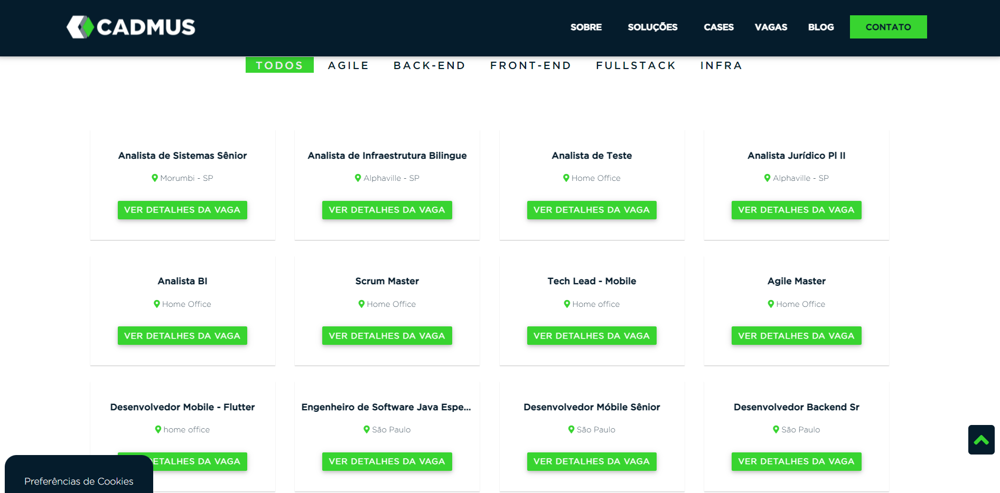
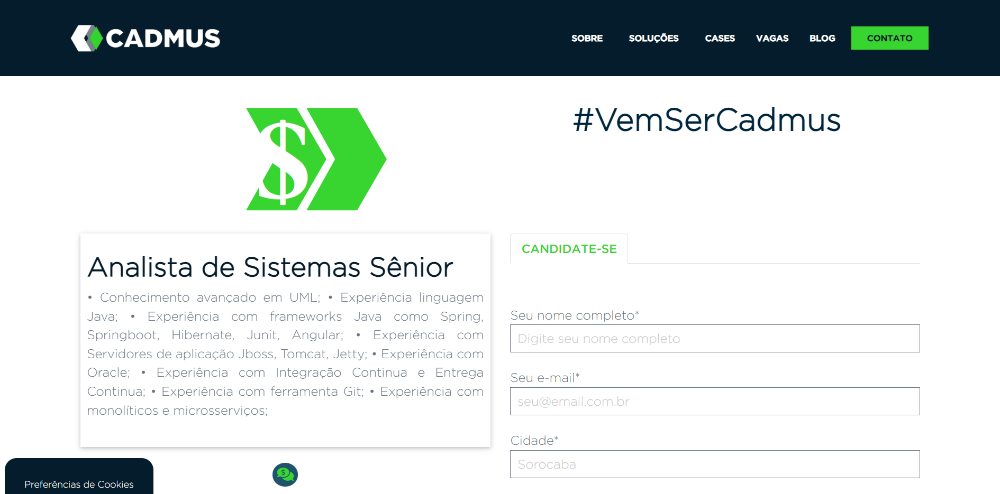
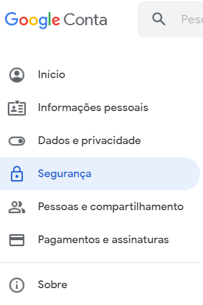
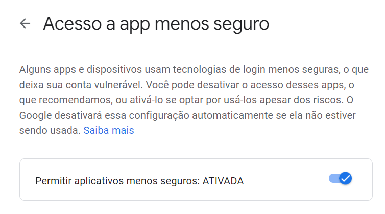

# DESCRIÇÃO DO PROJETO

A área de Recursos Humanos é responsável pelo processo de recrutamento dentro de uma determinada empresa.
Para mensurar a efetividade e desempenho da equipe de recrutamento o Gerente de Recursos Humanos atribuiu
a tarefa de gerar um relatório analítico de vagas abertas da empresa ao Assistente Administrativo. Diariamente
o Assistente Administrativo acessa o endereço <https://cadmus.com.br/vagas-tecnologia/> através do navegador
para extrair as vagas em aberto e compilar os dados em uma planilha do excel que contém minimamente três colunas
**(nome, local e descrição)**. Com a planilha formatada o Assistente Administrativo encaminha o 
documento por e-mail para o Gerente de Recursos Humanos para que seja feita a análise desejada.

# ETAPAS

### ETAPA 1

* Acessar o site da **CADMUS:**


* Rolar a página até as vagas abertas:



* Percorrer cada vaga, armazenando o nome e a localidade em listas.
  


* Para armazenar a descrição da vaga em uma lista, é necessário clicar no botão:


* Aguardar o carregamento da página e realizar o armazenamento das informações:



* Retornar para a página de vagas abertas e efetuar o mesmo procedimento para as demais vagas.


### ETAPA 2

* Gerar a planilha excel: Após o preenchimento das 3 listas na etapa anterior e com o auxílio
da biblioteca **Pandas** do Python, é possível criar a planilha.
* A planilha contem 3 colunas respectivamente: **(Nome, Local, Descrição)**.


### ETAPA 3

* Enviar o email contendo a planilha em anexo.

* Para enviar o email, as variáveis devem ser modificadas no arquivo **configs/.config.yml**:
  
~~~yml
# Os emails e a senha devem ser modificados

email_login: teste1@gmail.com

password: senha_email

email_to: teste2@gmail.com
~~~

* O código está configurado para a utilização do **gmail**, mas ainda é necessário realizar uma configuração
manual no email de origem.
* Acessar as configurações da conta:



* Selecionar o item de menu **Segurança**.
* Permitir o acesso a app menos seguro:




# CONFIGURAÇÃO DO AMBIENTE

* Instale o Python na versão 3.8.3 - 64bits.
* Crie uma virtualenv.


### Criando uma virtual env

É importante que a versão do Python na virtualenv seja a mesma versão instalada na máquina onde o projeto irá rodar. 
Para saber a versão e a localização do Python na máquina, digite o código na linha de comando:

```commandline
py --version
```

Conferido a versão do Python, crie uma virtual env e ative-a, para não haver conflito entre as versões das bibliotecas.

```shell
# Instala a maquina virtual
pip install virtualenv

# Nas versões mais recentes do python
# Diretório padrão do Python 3.8: C:/Users/rpa/AppData/Local/Programs/Python/Python38/python.exe
# Ex: virtualenv --python=C:/Users/rpa/AppData/Local/Programs/Python/Python38/python.exe diretorio/desejado/.venv
virtualenv --python=C:/diretório/da/versão/do/python/python.exe .venv

# Ativa a virtual env
.venv/Scripts/activate

#desativa a virtual env
deactivate

# Para buscar por comandos específico na virtual env
virtualenv -h
```

* Após a ativação da virtual env no console, basta instalar as dependências que se encontram no arquivo do projeto
configs/requirements.txt
  
~~~shell
pip install -r configs/requirements.txt
~~~